# dotfiles

[](https://deepwiki.com/i9wa4/dotfiles)

## 1. Target OS

- macOS (Apple Silicon)
- Ubuntu 24.04 LTS (TODO)
- Ubuntu 24.04 LTS on WSL2 (TODO)

## 2. Prerequisites

### 2.1. GitHub SSH Key

1. Generate SSH key and add to GitHub.
   - <https://qiita.com/ucan-lab/items/e02f2d3a35f266631f24>

### 2.2. GitHub Signing Key

1. Add signing key for commit verification.
   - <https://qiita.com/habu1010/items/dbd59495a68a0b9dc953>

## 3. macOS Installation

### 3.1. Install Command Line Developer Tools

```sh
git --version
```

### 3.2. Clone dotfiles

```sh
git clone git@github.com:i9wa4/dotfiles ~/ghq/github.com/i9wa4/dotfiles
cd ~/ghq/github.com/i9wa4/dotfiles
```

### 3.3. Install Nix

```sh
sh <(curl --proto '=https' --tlsv1.2 -L https://nixos.org/nix/install)
```

Open a new terminal to verify:

```sh
nix --version
```

cf. [Nix Official Download](https://nixos.org/download/)

### 3.4. Install Homebrew

nix-darwin manages Homebrew packages, but Homebrew itself must be installed manually.

```sh
/bin/bash -c "$(curl -fsSL https://raw.githubusercontent.com/Homebrew/install/HEAD/install.sh)"
```

cf. [Homebrew](https://brew.sh/)

### 3.5. Create user.nix

```sh
cp user.nix.example user.nix
# Edit user.nix and set your username (run `whoami` to get it)
```

### 3.6. Backup Shell Configs

nix-darwin will fail if /etc/bashrc or /etc/zshrc exist with unrecognized content.

```sh
sudo mv /etc/bashrc /etc/bashrc.before-nix-darwin 2>/dev/null || true
sudo mv /etc/zshrc /etc/zshrc.before-nix-darwin 2>/dev/null || true
```

cf. `https://github.com/nix-darwin/nix-darwin/issues/149`

### 3.7. Initial darwin-rebuild

```sh
sudo nix --extra-experimental-features 'nix-command flakes' run nix-darwin -- switch --flake '.#macos-p' --impure --no-update-lock-file
```

Open a new terminal after completion.

### 3.8. Set PC-specific Git Config

```sh
git config --global user.name "Your Name"
git config --global user.email "your@email.com"
```

These are written to ~/.gitconfig, which takes precedence over nix-managed ~/.config/git/config.

## 4. Linux Installation

TODO: Will be added later with home-manager standalone configuration.

## 5. Post Installation

### 5.1. gh (GitHub CLI)

```sh
gh auth login
# Choose SSH for Git operation protocol
# Skip uploading SSH public key
# Login with a web browser
```

To copy auth to another machine:

```sh
gh auth status --show-token | gh auth login --with-token
```

### 5.2. AWS CLI

- [Configuring IAM Identity Center authentication with the AWS CLI](https://docs.aws.amazon.com/cli/latest/userguide/cli-configure-sso.html)
- [Configuration and credential file settings](https://docs.aws.amazon.com/cli/latest/userguide/cli-configure-files.html)

### 5.3. Web Browser

#### Setting Synchronization

- Password: No
- Address: No
- Google Pay: No
- The Others: Yes

#### Search Engine

- Google Japanese: `https://www.google.com/search?q=%s`
- Google English: `https://www.google.com/search?q=%s&gl=us&hl=en&gws_rd=cr&pws=0`

#### Extensions

- Flow Chat for YouTube Live
- Okta Browser Plugin

### 5.4. Slack

GitHub Notifications:

```text
/github subscribe owner/repo reviews,comments,branches,commits:*
```

## 6. Daily Update

Use zeno snippet `up` or run manually:

```sh
cd ~/ghq/github.com/i9wa4/dotfiles
sudo darwin-rebuild switch --flake '.#macos-p' --impure
ghq list | ghq get --update
cd ~/ghq/github.com/i9wa4/internal && uv run quarto render work/
```

Or use zeno snippet `ndr` for just darwin-rebuild:

```sh
# ndr expands to:
sudo darwin-rebuild switch --impure --flake ".#$(awk -F'"' '/darwinConfigurations\./{print $2}' flake.nix | fzf)"
```

## 7. Reference

### 7.1. nix-darwin GUI Settings

#### Reading Current Settings

```sh
defaults read com.apple.dock           # Dock
defaults read com.apple.finder         # Finder
defaults read NSGlobalDomain           # Global settings
defaults read com.apple.menuextra.clock # Menu bar clock
defaults read com.apple.controlcenter  # Control Center
```

#### Domain to nix-darwin Mapping

| defaults domain | nix-darwin option |
|---|---|
| `com.apple.dock` | `system.defaults.dock.*` |
| `com.apple.finder` | `system.defaults.finder.*` |
| `NSGlobalDomain` | `system.defaults.NSGlobalDomain.*` |
| `com.apple.menuextra.clock` | `system.defaults.menuExtraClock.*` |
| `com.apple.controlcenter` | `system.defaults.controlcenter.*` |
| `com.apple.trackpad` | `system.defaults.trackpad.*` |

#### Adding Settings

```nix
# darwin/configuration.nix

# If nix-darwin option is available
system.defaults.dock.autohide = true;

# If not available, use activation script
system.activationScripts.postActivation.text = ''
  sudo -u ${username} bash -c '
    defaults write com.apple.SomeApp SomeKey -bool true
  '
'';
```

### 7.2. Zsh Startup and Nix PATH

```mermaid
flowchart TD
    subgraph "Zsh Startup (Interactive Login Shell)"
        A[zsh starts] --> B["/etc/zshenv<br/>(nix-darwin managed)"]
        B --> C["source set-environment<br/>PATH = Nix paths + system paths"]
        C --> D["~/.zshenv<br/>(user dotfiles)"]
        D --> E["source dot.zshenv<br/>PATH = Homebrew + ... + PATH"]
        E --> F["/etc/zprofile"]
        F --> G["~/.zprofile"]
        G --> H["/etc/zshrc<br/>(nix-darwin managed)"]
        H --> I["~/.zshrc<br/>(user dotfiles)"]
        I --> J["source dot.zshrc"]
        J --> K[Shell Ready]
    end

    style B fill:#4c9,stroke:#333
    style H fill:#4c9,stroke:#333
    style D fill:#69c,stroke:#333
    style I fill:#69c,stroke:#333
```



| File | Managed By | Role |
|------|------------|------|
| `/etc/zshenv` | nix-darwin | Sources `set-environment`, sets Nix PATH |
| `/etc/zshrc` | nix-darwin | Sets history, completion, prompt defaults |
| `~/.zshenv` | dotfiles | Sources `dot.zshenv`, adds Homebrew to PATH |
| `~/.zshrc` | dotfiles | Sources `dot.zshrc`, user configurations |

### 7.3. Python Virtual Environment

```sh
# Update lock file
uv lock --upgrade

# Sync virtual environment
uv sync --frozen
# or with dev dependencies
uv sync --frozen --group dev
```

### 7.4. SSH Connection to Ubuntu Server

cf. [Linux サーバー：SSH 設定](https://zenn.dev/wsuzume/articles/26b26106c3925e)

1. [Server] Set `PasswordAuthentication yes` in `/etc/ssh/sshd_config`
2. [Server] `sudo systemctl restart ssh.service`
3. [Client] `ssh-keygen -t ed25519`
4. [Client] `ssh -p port username@hostname`
5. [Client] `scp -P port ~/.ssh/id_ed25519.pub username@hostname:~/.ssh/register_key`
6. [Server] `cat ~/.ssh/register_key >> ~/.ssh/authorized_keys && chmod 600 ~/.ssh/authorized_keys`
7. [Server] Set `PasswordAuthentication no` and restart ssh
8. [Client] Configure `~/.ssh/config`

### 7.5. External Links

- [nix-darwin README](https://github.com/nix-darwin/nix-darwin)
- [home-manager Manual](https://nix-community.github.io/home-manager/)
- [2025年のdotfiles](https://zenn.dev/momeemt/articles/dotfiles2025)
- [Homebrew管理下のGUIもNixに移してみる](https://zenn.dev/kawarimidoll/articles/271c339c5392ce)
