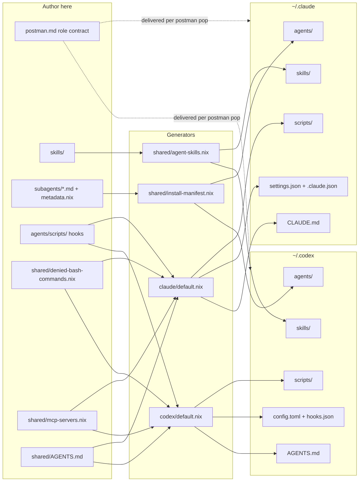

# Agents Tree Map

This directory is the source tree for the shared Claude Code and Codex CLI
setup.
Humans should edit files here, then rebuild.
Do not hand-edit `~/.claude/` or `~/.codex/`; those are installed runtime
artifacts.

## 1. Start Here

| If you want to change...    | Edit here                                                   | Installed result                                                                                                                           |
| --------------------------- | ----------------------------------------------------------- | ------------------------------------------------------------------------------------------------------------------------------------------ |
| Persona / language / scope  | `config/tmux-a2a-postman/postman.md` `[common_template]`    | Delivered into every postman role on each `tmux-a2a-postman pop`                                                                           |
| Local-invocation fallback   | `shared/AGENTS.md` (single authored source)                 | Installed as `~/.codex/AGENTS.md` directly and `~/.claude/CLAUDE.md` derived from the same source; does not duplicate the postman contract |
| Dotfiles-owned skill bodies | `skills/<skill>/SKILL.md`                                   | Installed to both engines and indexed by postman.md `skill_path`                                                                           |
| Native review skill         | `skills/subagent-review/SKILL.md`                           | Documents runtime-native reviewer subagent usage without ad hoc dispatcher tiers                                                           |
| Native reviewer prompts     | `subagents/*.md`                                            | Prompt bodies for generated Claude Markdown and Codex TOML agent files                                                                     |
| Native reviewer metadata    | `subagents/metadata.nix`                                    | Per-agent model and effort defaults emitted into generated runtime agent files                                                             |
| Shared install targets      | `shared/install-manifest.nix`                               | Resolves generated Claude agent files and Codex TOML from shared subagent sources                                                          |
| Local reusable skills       | `skills/<skill>/`, `shared/agent-skills.nix`                | Installed to `~/.claude/skills/` and `~/.codex/skills/` through the curated active source set                                              |
| External reference router   | `skills/external-references/SKILL.md`                       | Active local skill that routes Databricks/dbt/Azure/Google/AWS/Terraform/Obsidian provider-pack questions to dormant references            |
| Dormant skill references    | `shared/agent-skills.nix` `referenceOnlySources`            | Pinned in Nix and materialized as a flat reference-only tree under `~/.local/share/skills`; not installed into active runtime loader paths |
| Skill description index     | `skills/dotfiles/`                                          | Owned by the dotfiles skill (skills-management reference and bundled script)                                                               |
| Hook/runtime scripts        | `scripts/*`                                                 | Installed to `~/.claude/scripts/` and/or `~/.codex/scripts/`                                                                               |
| Shared runtime data         | `shared/mcp-servers.nix`, `shared/denied-bash-commands.nix` | Empty MCP server set and shared Bash deny hook data emitted into both engines                                                              |
| Claude runtime settings     | `claude/default.nix`                                        | `~/.claude/settings.json`, `~/.claude/.claude.json`, and symlinked runtime dirs                                                            |
| Codex runtime settings      | `codex/default.nix`                                         | `~/.codex/config.toml`, `~/.codex/hooks.json`, and symlinked runtime dirs                                                                  |
| Top-level package boundary  | `default.nix`                                               | Imports the agent modules and installs the shared CLI packages                                                                             |

## 2. Design Principle

Author policy once, against Claude Code as the reference engine, and emit the
same policy into Codex. Shared sources own the behavior; `claude/default.nix`
and `codex/default.nix` are thin emitters that map those sources onto each
product surface. A per-engine difference is allowed only with a written reason
next to it (see `skills/dotfiles/references/agent-config-philosophy.md`).

## 3. How Changes Flow

1. Edit the source markdown, scripts, skills, or Nix modules in this tree.
2. The persona / language / scope contract is delivered through
   `config/tmux-a2a-postman/postman.md` `[common_template]` on each
   `tmux-a2a-postman pop`. Dotfiles-owned skill bodies stay in
   `skills/<skill>/SKILL.md`; postman traffic gets only the generated
   `skill_path` catalog. `shared/AGENTS.md` is the single authored source for
   direct, non-postman invocations: `~/.codex/AGENTS.md` installs it directly
   and `~/.claude/CLAUDE.md` is derived from the same source, not a second
   hand-written file. It points at the skill catalog and does not duplicate
   the postman contract.
3. `subagents/*.md` is the committed Markdown source of truth for native
   reviewer prompt bodies. `subagents/metadata.nix` is the shared source for
   runtime defaults such as model and effort. `shared/install-manifest.nix`
   generates Claude Markdown into `~/.claude/agents/` and Codex TOML into
   `~/.codex/agents/` from those sources.
4. `skills/subagent-review/SKILL.md` is installed through the normal local skill
   pipeline and documents reviewer usage without generating agent files.
5. `shared/install-manifest.nix` resolves the shared agent install targets and
   skill destinations that the runtime installers consume.
6. `shared/agent-skills.nix` validates local and patched Anthropic skill
   sources, discovers the other active sources, and installs the curated active
   source set into Claude. Codex is materialized from a hardcoded source
   allowlist so wrapper-promoted provider packs do not consume Codex startup
   skill context unless the Codex allowlist is changed too. The active
   `external-references` local skill names dormant provider packs and routes
   lookup or promotion decisions to `~/.local/share/skills`; broad external
   provider packs remain named in `referenceOnlySources` and materialized
   outside active Claude/Codex loader paths.
7. `claude/default.nix` and `codex/default.nix` materialize the final runtime
   files during activation.

## 4. Refresh And Verify

| Goal                        | Command                                                   |
| --------------------------- | --------------------------------------------------------- |
| Validate the repo           | `nix flake check`                                         |
| Rebuild + activate on Linux | `nix run '.#switch'`                                      |
| Direct Linux activation     | `home-manager switch --flake '.#ubuntu' --impure`         |
| Rebuild + activate on macOS | `nix run '.#switch'`                                      |
| Direct macOS activation     | `sudo darwin-rebuild switch --flake '.#macos-p' --impure` |
| Direct macOS activation     | `sudo darwin-rebuild switch --flake '.#macos-w' --impure` |

## 5. Authoring Notes

- Keep reviewer agent prompt bodies and runtime metadata in `subagents/`. Do
  not hand-author or track generated Claude Markdown or Codex TOML copies.
  Runtime model defaults are explicit in `subagents/metadata.nix`; Codex
  `model = null` means the generated TOML omits `model` and inherits the parent
  session. Keep reviewer usage guidance in `skills/subagent-review/SKILL.md`.
- Keep active skill loader paths small and intentional. Add always-on Claude
  skills to the active source set in `shared/agent-skills.nix`; keep broad
  provider packs in `referenceOnlySources`, which are generated into the flat
  reference-only tree at `~/.local/share/skills`, unless they are deliberately
  promoted through `i9wa4.agentSkills.extraSources`. Codex has an additional
  source allowlist and skill-selection allowlist in the same file; update both
  only when the promoted source should also be loaded by Codex.
- After setting up Claude Code on a new machine or after adding new projects,
  use `/dotfiles` and its Claude workspace trust workflow;
  otherwise interactive `PreToolUse` hooks can be skipped until workspace trust
  is recorded.

## 6. Rule Of Thumb

- If you are changing prompt wording, start with the markdown source files.
- If you are changing hook behavior, runtime settings, or install targets, edit
  the `.nix` modules.
- If a file lives under `shared/` and is named `install-manifest.nix`,
  `agent-skills.nix`, `mcp-servers.nix`, or `denied-bash-commands.nix`, it is
  composition or shared data code rather than final installed prompt text.
- Treat `~/.claude/` and `~/.codex/` as outputs of this tree, not as the
  editing surface.
