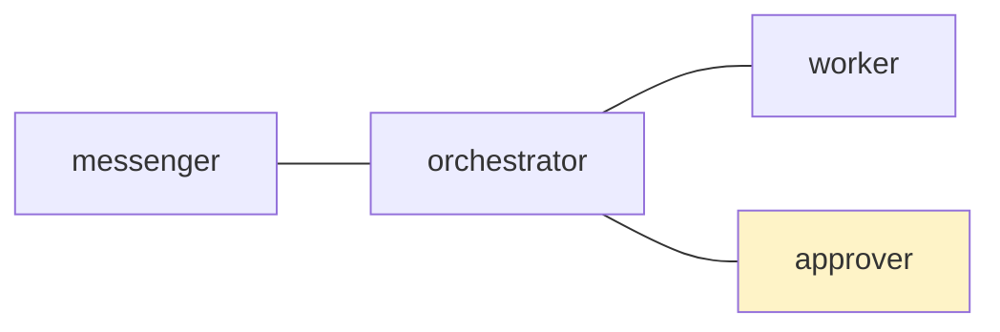
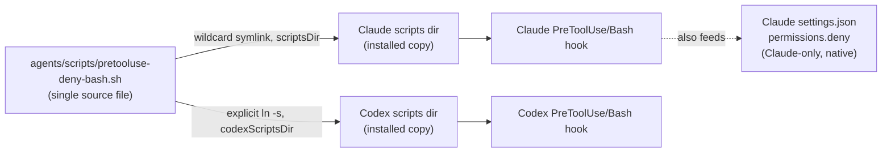
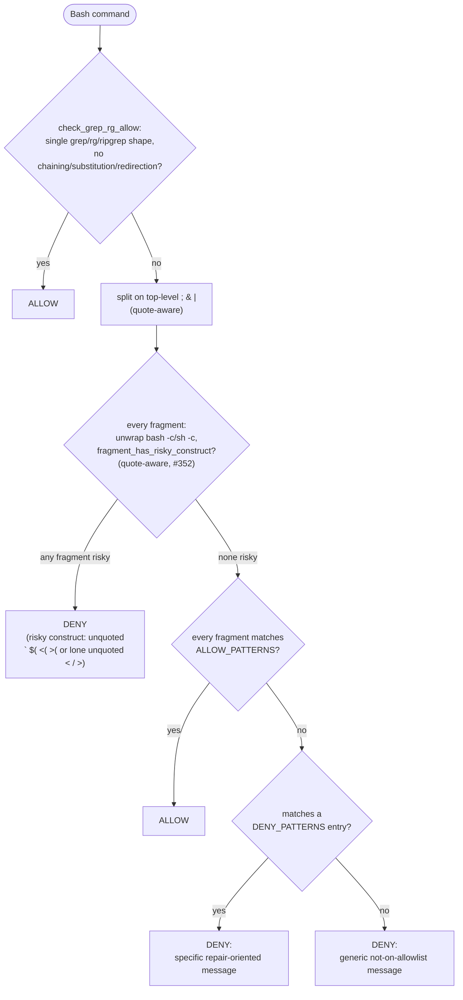

# Agent Command Approval Design

This design documents the current command approval and writable-surface model
for Codex CLI, Claude Code, and the postman-mediated command approval layer.
The May 2026 sections describe runtime permission design for issue #201; the
July 2026 update records the adopted `tmux-a2a-postman execute-bash` contract.

Update checked on 2026-07-13:

- Local `tmux-a2a-postman --version`: `git-c928f9d`.
- Adjacent `tmux-a2a-postman` source repo recent changes include command
  approval through `execute-bash`, reply-delivered approval requests, and the
  migration of the approver marker to the Mermaid `command_approver_node`
  class.
- `diplomat_node` is a separate, not-yet-shipped design issue for
  cross-session edge authorization. Do not configure it in dotfiles until that
  issue lands in `tmux-a2a-postman`.
- This repo currently has `config/tmux-a2a-postman/postman.md` only; there is
  no checked-in `postman.toml` policy file.

Sources checked on 2026-05-30:

- OpenAI Codex sandboxing:
  <https://developers.openai.com/codex/concepts/sandboxing>
- OpenAI Codex auto-review:
  <https://developers.openai.com/codex/concepts/sandboxing/auto-review>
- OpenAI Codex permission profiles:
  <https://developers.openai.com/codex/permissions>
- Claude Code permissions:
  <https://code.claude.com/docs/en/permissions>
- Claude Code settings:
  <https://code.claude.com/docs/en/settings>
- Claude Code sandboxing:
  <https://code.claude.com/docs/en/sandboxing>

## 1. Current Agent Launch Layer

The tmux/vde launcher is the highest-precedence behavior for active panes.
Today `config/vde/layout.yml` starts Codex panes with:

```sh
codex --yolo --add-dir "${SUBDIR}" --model gpt-5.5 --config model_reasoning_effort=xhigh
```

It starts the Claude critic pane with:

```sh
claude --allow-dangerously-skip-permissions --dangerously-skip-permissions \
  --add-dir "${SUBDIR}" \
  --model "opus[1m]" --effort xhigh
```

That means current postman panes are intentionally high-autonomy sessions:
approval prompts and permission-layer prompts are mostly bypassed at launch
time. Repo-managed PreToolUse hooks are a separate configured guardrail layer
from runtime permission rules. This design does not count Claude
`permissions.deny` rules as active for the bypass-launched critic pane unless
a version-specific verification proves that behavior. The `--add-dir` value
extends the workspace surface for each session. The exact extra directory is
chosen by the vde session environment, not by Home Manager agent config.

The current local tool versions observed during the 2026-07-14 refresh were
`codex-cli 0.144.3` and `Claude Code 2.1.207`.

## 2. Current Codex Behavior

Repo-owned Codex config lives primarily in
`nix/home-manager/agents/codex/default.nix`.

### 2.1. Command Approval

<!-- private-content-scan: allow-next-line -->
The managed `~/.codex/config.toml` base does not currently set
`sandbox_mode`, `approval_policy`, `approvals_reviewer`, or
`default_permissions`. The active postman approval behavior therefore comes
from the launcher command. In the current worker launch, `--yolo` results in a
full-access Codex session with sandbox mode `danger-full-access` and approval
policy `never`.

The managed config does set:

- `network_access = true`
- `web_search = "live"`
- `features.hooks = true`
- `features.multi_agent = true`
- `features.skills = true`
- TUI status items for `permissions` and `approval-mode`

The status line is important because it makes launch-mode drift visible in the
pane before the agent starts making changes.

### 2.2. Sandbox And Writable Surface

Codex's sandbox and approval controls are not the same layer as the shared
Bash deny hook. The OpenAI docs describe the common sandbox modes as:
`read-only`, `workspace-write`, and `danger-full-access`. They describe the
common approval policies as `untrusted`, `on-request`, and `never`.

The repo currently relies on launcher-level `--yolo --add-dir` for the active
postman panes. Home Manager does not yet define a least-privilege Codex
workspace profile. The generated config does mark owned `ghq` repositories as
trusted projects, but trust is not a writable-root boundary. It controls
project trust state, not what the sandbox may modify.

Codex hooks currently add these local checks:

- `PreToolUse` `Bash` runs
  `nix/home-manager/agents/scripts/pretooluse-deny-bash.sh`.
- `PreToolUse` `apply_patch|Edit|Write` runs
  `nix/home-manager/agents/scripts/codex-pretooluse-observe-write.sh`.

The write hook is observation-only. Codex has no repo-managed role-aware write
deny equivalent to Claude's `claude-pretooluse-deny-write.sh`.

`scripts/lazygit/ai-commit.sh` is separate from postman agent panes. It uses
`codex exec --ephemeral --ignore-rules --sandbox read-only -c
approval_policy='"never"'` for commit-message generation from a staged diff,
and should not be used as evidence for interactive agent-pane approval
behavior.

### 2.3. Auto-Review

Codex auto-review is not configured today. OpenAI documents auto-review as an
approval reviewer choice, not a sandbox boundary change: eligible approval
requests can route to a reviewer agent, while actions already allowed inside
the sandbox still run without extra review.

Because auto-review is Codex-specific and does not replace the existing
guardian/critic/human approval lane, the first implementation should be
**opt-in**, not default. The current default launcher should remain unchanged
until the opt-in profile has evidence for the verification scenarios in
section 7.

## 3. Current Claude Code Behavior

Repo-owned Claude config lives primarily in
`nix/home-manager/agents/claude/default.nix`.

### 3.1. Permission Rules

Claude settings are generated by Home Manager and copied to the writable user
<!-- private-content-scan: allow-next-line -->
settings file `~/.claude/settings.json`. The repo currently configures
`permissions.deny`, but it does not configure `permissions.allow`,
`permissions.ask`, `permissions.defaultMode`, `allowedTools`,
`disallowedTools`, or `permissionMode`.

The current deny set is:

- `deniedBash.claudeCode.denyPermissions` from
  `nix/home-manager/agents/shared/bash-commands-denied.nix` for selected
  high-consequence Bash commands.
- `Read(**/*key*)`
- `Read(**/*token*)`
- `Read(.env*)`
- `Read(~/.ssh/**)`
- `Edit(**/secrets/**)`
- `Edit(.env*)`

Claude Code evaluates deny, ask, and allow rules as runtime permission policy,
not as prompt guidance. The official docs also note that read and edit deny
rules apply to built-in file tools and recognized file-reading shell commands,
but not to arbitrary subprocesses that open files themselves.

This deny set documents the current configured permission policy. The current
critic pane is launched with `--allow-dangerously-skip-permissions` plus
`--dangerously-skip-permissions`, and installed Claude Code 2.1.210 help
describes the first flag as enabling bypass as an option and the second as
selecting bypass mode. Therefore the design treats `permissions.deny` as a
non-bypass expectation unless a follow-up captures installed-version evidence
that a specific deny rule still applies in bypass mode.

### 3.2. Launch Mode And Hooks

The vde launcher starts the Claude critic pane with the two bypass flags
followed by `--add-dir "${SUBDIR}"`. The allow flag makes bypass mode
selectable, and the dangerous skip flag selects it. That suppresses normal
permission prompts and, per the installed help, bypasses permission checks for
that pane. Do not use the current critic launch as evidence that
`permissions.deny` is enforced.

The repo configures these Claude hooks:

- `UserPromptSubmit` runs
  `nix/home-manager/agents/scripts/common-userpromptsubmit.sh claude`.
- `PreToolUse` `Bash` runs the shared
  `nix/home-manager/agents/scripts/pretooluse-deny-bash.sh`.
- `PreToolUse` `Write|Edit|NotebookEdit` runs the Claude-only
  `nix/home-manager/agents/scripts/claude-pretooluse-deny-write.sh`.

These hooks are distinct from the Claude permission-layer rules above. The
installed help names `--bare`, not `--dangerously-skip-permissions`, as the
mode that skips hooks. This design therefore keeps hook verification separate
from permission-rule verification: the current bypass launch may rely on the
configured PreToolUse hook layer only after a scenario proves the hook fires.

The Claude write-deny hook enforces the multi-agent role contract for panes
that should not mutate the repo. Codex does not have an equivalent role
contract today.

### 3.3. Sandbox And Writable Surface

Claude Code has two distinct controls:

- Permissions decide whether a tool call may run.
- Sandboxing provides OS-level restrictions for Bash commands and their child
  processes.

The current repo config does not enable Claude's `sandbox` block. File access
comes from the launch directory plus `--add-dir`; the official docs state that
additional directories grant file access, not full configuration-root status.

`CLAUDE_CODE_SUBPROCESS_ENV_SCRUB` is currently set to `0` because enabling it
forced permission mode back to `default` and broke the current
`--dangerously-skip-permissions` flow. Re-enabling credential scrubbing should
wait until a follow-up defines explicit allow rules or an equivalent sandboxed
Claude profile.

## 4. Shared Policy Versus Runtime-Specific Settings

| Intent                               | Shared home                                                                          | Runtime-specific home                                                                                                                                            | Current design                                                                                                                                                                                           |
| ------------------------------------ | ------------------------------------------------------------------------------------ | ---------------------------------------------------------------------------------------------------------------------------------------------------------------- | -------------------------------------------------------------------------------------------------------------------------------------------------------------------------------------------------------- |
| Dangerous Bash command denies        | `nix/home-manager/agents/shared/bash-commands-denied.nix`; `pretooluse-deny-bash.sh` | Claude additionally receives selected `permissions.deny` globs for non-bypass permission profiles; Codex receives the shared hook patterns                       | Shared SSOT owns command-deny intent. For the bypass-launched Claude critic, verify the PreToolUse hook separately and do not claim `permissions.deny` enforcement without installed-version evidence.   |
| Postman message and mailbox workflow | `config/tmux-a2a-postman/postman.md` and shared hook bypass data                     | Runtime hook registration paths differ                                                                                                                           | Keep postman state operations prompt-first plus hook-compatible. The shared deny hook must not false-positive on heredoc message bodies.                                                                 |
| Sensitive file read/write denies     | Policy intent should be shared                                                       | Claude has direct `Read`/`Write` denies for non-bypass permission profiles today; Codex needs sandbox or permission-profile rules in a follow-up                 | Preserve Claude's configured file denies, but do not treat them as enforced for bypass-launched panes unless tested. Add equivalent Codex boundaries only through Codex-native sandbox/profile settings. |
| Filesystem and network blast radius  | Design principle only                                                                | Codex uses sandbox modes, approval policy, writable roots, or permission profiles. Claude uses permission rules plus optional Bash sandbox or process isolation. | Keep the policy goal aligned, but implement boundaries through each runtime's native controls.                                                                                                           |
| Human review lane                    | `postman.md` approval route and review skills                                        | Codex `approvals_reviewer = "auto_review"` is Codex-only                                                                                                         | Auto-review may assist Codex approval prompts, but it must not replace guardian/critic/human approval gates.                                                                                             |
| Role-based write restrictions        | `postman.md` role contract                                                           | Claude has `claude-pretooluse-deny-write.sh`; Codex currently observes write payloads only                                                                       | Keep Claude enforcement. Add Codex enforcement only after the observed write payloads support a reliable rule.                                                                                           |

### 4.1. Postman Command Approval Layer

`tmux-a2a-postman execute-bash` is now the shared command-approval wrapper for
postman sessions. It records requester, reviewer audit label, label, category,
mode, command digest, reason, expiry, approval thread id, decision, and exit
status, then runs the command through `bash -lc` only when the selected mode
allows it.

This wrapper is coordination and audit, not a security boundary. It does not
sandbox Bash, block direct shell execution, or prevent another process from
running the same command. Keep runtime enforcement in Codex sandboxing, Claude
permissions/sandboxing, or the shared PreToolUse hooks when the rule must hold
against bypass.

Approver policy therefore has two separate sources:

- Structured deny data belongs in
  `nix/home-manager/agents/shared/bash-commands-denied.nix` when the rule is a
  concrete Bash pattern that should be blocked before execution in both
  runtimes. Each entry carries its repair-oriented rationale.
- Human approval gates belong in `config/tmux-a2a-postman/postman.md` because
  they depend on intent, target surface, provenance, and current human approval
  evidence rather than only argv tokens.

Do not collapse these into one JSON command list. A structured list is useful
for deterministic command-pattern denies, but it is the wrong shape for public
write approval because `gh`, `git`, scripts, and wrapper lanes can express the
same side effect in many forms. Keep the prose approver contract as the policy
that interprets side effects and evidence, and keep the Nix deny list as the
runtime guardrail for concrete prohibited Bash patterns.

The approver contract must reject or block any request that lacks explicit
current human approval for public GitHub writes, remote ref updates, branch
publication, PR creation or update, GitHub comments/reviews, tags, releases,
or production-data writes. `tmux-a2a-postman execute-bash` does not make a
command safe; the approver must inspect the inner command and requested side
effects before deciding.

The real approver is not the `reviewer` field in a policy or CLI flag.
`reviewer` is an audit label. The authenticated approver is the single node
marked in the `postman.md` Mermaid graph:



This repo marks the dedicated `approver` node as that singleton. All command
approval policies share the same approver. Per-policy approver routing is not
supported.

The fail-open rule is the most important operational detail: `advisory`,
`warn-only`, and `blocking` become restrictive only when the Mermaid
`command_approver_node` resolves to a real configured node. If the marker is
absent or misspelled, every wrapper-mediated command runs and is recorded as
`auto_approved_no_reviewer`, including commands requested in `blocking` mode.
Migration is complete only when `tmux-a2a-postman get-status` has neither
`command_approval.unresolved_command_approvers` nor
`command_approval.deprecated_command_approvers`.

When a command needs approval and a valid approver exists, `execute-bash`
delivers a reply-required approval request to that approver. The approver can
decide by replying on the approval thread with a body starting
`APPROVED: <reason>` or `NOT APPROVED: <reason>`, preserving the supplied
`thread_id` in frontmatter. The approver can also decide from its own pane:

```sh
tmux-a2a-postman execute-bash \
  --thread-id command-approval-... \
  --record-decision approved \
  --reason "digest reviewed"
```

Decision identity always comes from the calling tmux pane title or the reply
sender, never from `--reviewer`. A decision attempted from any pane other than
the resolved `command_approver_node` is refused or recorded as wrong reviewer.

Current dotfiles adoption:

- `config/tmux-a2a-postman/postman.md` adds a dedicated `approver` node and
  marks it with
  `command_approver_node`.
- `config/vde/layout.yml` starts an `approver` pane in the standard `preset-p`
  and `preset-w` team layouts. This is required: a Mermaid approver marker that
  has no live pane title resolves as unavailable and can leave blocking command
  approval in fail-open mode.
- `config/vde/layout.yml` also starts a reserved `diplomat` pane so future
  cross-session design traffic has a stable node name, but no `diplomat_node`
  routing is configured yet.
- The common template states that `execute-bash` is the only postman-mediated
  command approval lane and that direct shell execution bypasses its audit.
- The approver role contract tells approver to approve or reject command
  approval threads, and not to run the requested command locally while acting
  as approver.
- The orchestrator role contract routes command-approval policy questions to
  `approver` rather than deciding approval threads itself.
- Worker roles must use `execute-bash` with a specific `--label`,
  `--category`, and `--reason` when delegated work requires this approval lane.
- There is still no checked-in `postman.toml` command policy. Any future
  blocking policy must be added alongside a verification showing the valid
  Mermaid approver marker survives config load.

### 4.2. Bash Command Allow/Deny Mechanism (Current Implementation)

This section documents the shared `pretooluse-deny-bash.sh` hook's actual
runtime behavior as implemented through issue #346 (default-deny redesign,
absorbing the former standalone grep/rg hook from issue #342) and issue #352
(quote-aware risky-construct fix). It is the concrete mechanism behind the
"Dangerous Bash command denies" row in the §4 table above.

#### 4.2.1. One Script, Two Installation Paths

`nix/home-manager/agents/scripts/pretooluse-deny-bash.sh` is the single
script both runtimes execute -- there is no separate Codex or Claude
implementation of the deny/allow logic itself. The two Nix modules differ
only in *how* that identical file gets installed, not in what it does once
it runs:

- Claude (`claude/default.nix`): `scriptsDir` symlinks every file under
  `agents/scripts/*` with a wildcard loop, so `pretooluse-deny-bash.sh`
  arrives automatically alongside any other script added to that directory.
- Codex (`codex/default.nix`): `codexScriptsDir` symlinks each script by an
  explicit `ln -s` line, `pretooluse-deny-bash.sh` included, with an in-file
  comment noting this is deliberate: "make the consumed hook surface
  reviewable in this file" rather than implicit.

Both wire the resulting installed script to the same `PreToolUse` / `Bash`
hook matcher in their respective hook configs, and both source the same
generated `deny-bash-patterns.sh` (from `bash-commands-denied.nix` /
`bash-commands-allowed.nix`) placed beside it.



Installed locations (Home Manager-managed, not repo paths): the Claude copy
<!-- private-content-scan: allow-next-line -->
lands at `~/.claude/scripts/pretooluse-deny-bash.sh`, and the Codex copy at
<!-- private-content-scan: allow-next-line -->
`~/.codex/scripts/pretooluse-deny-bash.sh`.

#### 4.2.2. Claude-Only Native Extra Layer

Four `bash-commands-denied.nix` entries (`rm`, `sudo`, `aws sso login`,
`tmux select-pane -T`) set `claudeSettingsJson = true`. Only for those four,
`claude/default.nix` also adds a derived glob (e.g. `Bash(rm *)`) to Claude's
own native `permissions.deny` in `settings.json` -- a structurally separate
enforcement layer from the `PreToolUse` hook script, evaluated by Claude
Code itself rather than by the hook subprocess. Codex has no equivalent
native permission engine, so for Codex those four commands rely on the
shared hook script alone; there is no `permissions.deny`-equivalent second
layer on the Codex side.

#### 4.2.3. Runtime Decision Flow

Every Bash command the hook sees is decided in this order; the first
matching stage wins and no later stage is consulted:

1. `check_grep_rg_allow` -- a dedicated procedural check for a single
   grep/rg/ripgrep invocation, ported verbatim from the former standalone

   #342 hook. It operates on the *whole raw command*, not a split fragment:

   any chaining, substitution, or redirection metacharacter anywhere in the
   command is an outright reject, and at most one `&&` is tolerated, only in
   the exact `cd <path> && grep/rg ...` shape. It also rejects sensitive
   keywords (`key`, `token`, `secret`, `.env`, `.ssh`, `credential`,
   `password`) and the substrings `rm`, `sudo`, `curl`, `wget` inside the
   grep/rg part.
2. `check_bash_command_for_allow` -- splits the command into fragments on
   top-level (unquoted) `;`, `&`, `|`, then for each fragment: unwraps
   `bash -c`/`sh -c` wrappers recursively, runs `fragment_has_risky_construct`
   (quote-aware as of #352 -- see below), strips `STRIP_DATA_ARGS` argument
   values (e.g. a `-m` commit-message value), then checks the fragment
   against `ALLOW_PATTERNS` (`bash-commands-allowed.nix`: `tmux-a2a-postman`,
   `ls`, `pwd`, `cat`, `head`, `tail`, `wc`, `sort`, `uniq`, `cut`, `date`,
   `whoami`, `which`, `echo`, `git status`/`diff`/`log`/`show`, and an
   end-anchored `git branch` exact-form entry). Every fragment must pass for
   the whole command to be allowed.
3. `check_bash_command_for_denials` -- `DENY_PATTERNS`
   (`bash-commands-denied.nix`). **This is not a second enforcement gate.**
   By the time this stage runs, the command has already missed every allow
   path above, so it is being denied either way; this stage only decides
   *which message* the agent sees -- a specific, repair-oriented
   justification for a recognized pattern (`git push`, `rm`, `sudo`, etc.),
   versus:
4. The generic "not on the allowlist for automatic execution" fallback for
   anything matching none of the above.

Every deny message, regardless of which stage produced it, appends a hint to
request the command via `tmux-a2a-postman execute-bash` instead of retrying
it directly.



#### 4.2.4. The #352 Fix: Quote-Aware Risky-Construct Detection

`fragment_has_risky_construct` exists to reject constructs that could
smuggle additional commands past a prefix-shaped `ALLOW_PATTERNS` match
(e.g. `ls > /etc/passwd`, `` ls `evil` ``, `ls $(rm -rf /)`) -- `ALLOW_PATTERNS`
only checks a fragment's leading token, so a trailing metacharacter has to
be caught separately, before any allow match is trusted.

As originally shipped in #349, this check was a naive substring scan with no
quoting awareness at all: any occurrence of `` ` ``, `$(`, `<(`, `>(`, `<`,
or `>` anywhere in the fragment was flagged, regardless of whether it was
live shell syntax or literal data inside quotes. This unconditionally denied
`tmux-a2a-postman send-heredoc --to <node> <<'DELIM' ... DELIM` -- postman's
own send mechanism -- because the heredoc operator's literal, unquoted `<`
characters tripped the check before the otherwise-matching `tmux-a2a-postman`
`ALLOW_PATTERNS` entry was ever consulted. It also denied harmless redirects
like a bare `2>&1` on an otherwise-fine command.

Issue #352 rewrote the check to walk the fragment character-by-character
with the same single/double-quote tracking `walk_bash_fragments` already
used for fragment splitting, plus two points that plain quote-awareness
alone does not cover:

- A run of two or more unquoted `<` (`<<`, `<<-`, `<<<`) is recognized as a
  heredoc or here-string marker -- which can never read an arbitrary file --
  and is not flagged. A single, standalone unquoted `<` is still real input
  redirection and remains risky.
- `` ` `` and `$(` remain risky even inside double quotes, because real bash
  still expands command substitution there; only single quotes fully
  suppress it. `<` and `>` lose their special meaning inside either quote
  type, so they are not flagged there.

#### 4.2.5. The #355 Fix: Heredoc BODY Content, Not Just The Marker

Issue #352 and PR #354 exempted the `<<`/`<<-`/`<<<` operator *marker* from
`fragment_has_risky_construct`, but left the heredoc **body** lines that
follow it unprotected. Since only `;`, `&`, `|` are top-level fragment
separators, a heredoc's marker line, body lines, and closing delimiter line
are all one fragment; the risky-construct char-walk continued scanning body
lines exactly like command text. A postman message body is Markdown-
formatted, so it routinely contains a bare backtick (inline code spans), a
literal `<`/`>`, or `$(...)` -- any one of these in the body denied the
entire `send-heredoc` call before the `tmux-a2a-postman` `ALLOW_PATTERNS`
entry was ever consulted, forcing operators back to hand-wrapping every such
call in `execute-bash --command`.

Issue #355 added `mask_heredoc_bodies` (plus the `detect_heredoc_operator`
helper), run once on `$COMMAND` before all three allow/deny decision paths.
It line-scans the raw command, recognizes a `<<`/`<<-` operator (excluding
`<<<` here-strings, which are single-line and have no body) outside quotes,
and swallows every following line up to and including the line that matches
the delimiter (tab-stripped first when the operator was `<<-`), while
leaving the operator line, the delimiter line, and everything else
unchanged. The masked command -- not the original -- is what
`check_grep_rg_allow`, `check_bash_command_for_allow`, and
`check_bash_command_for_denials` all scan; the original `$COMMAND` is still
what the final generic deny message shows the agent.

This fix does not change fragment splitting: a bare newline still is not a
top-level fragment separator. That is a separate, known, pre-existing gap
(a real command placed on the line immediately after a heredoc's closing
delimiter is not split into its own fragment, so it inherits whatever allow
decision the heredoc-bearing fragment gets) and is out of scope for #355 --
tracked as a follow-up rather than folded into this fix.

### 4.3. Diplomat Node Status

`diplomat_node` is not part of command approval. It is an open
`tmux-a2a-postman` design for tree-derived cross-session authorization:
sessions declared through `[[postman.workspace_tree]]` would each name one
`diplomat_node`, and those diplomats would be allowed to communicate across
parent/child session boundaries derived from the workspace tree.

Do not add a `diplomat_node` class or active cross-session authorization to
this repo yet. As of the 2026-07-13 check:

- The workspace tree prerequisite is present in `tmux-a2a-postman` through
  issue #504 / PR #622.
- The diplomat design itself remains open as issue #624.
- Related trust-ledger accountability work remains open as issue #614, and the
  diplomat design names that work as relevant to confused-deputy risk.
- `config/tmux-a2a-postman/postman.md` reserves a `diplomat` node for future
  design and policy routing only. It must report blocked for active
  cross-session relay until upstream support lands and this repo adds explicit
  verification gates.

When `diplomat_node` ships, the dotfiles follow-up should be separate from
command approval and should update:

- `config/tmux-a2a-postman/postman.md` only if the shipped syntax uses the
  Markdown topology file.
- `config/vde/layout.yml` if the existing reserved `diplomat` pane needs a
  different runtime, pane title, or launch placement for the shipped feature.
- A checked-in `postman.toml` only if the shipped syntax stays under
  `[[postman.workspace_tree]]`.
- The role contracts for whichever node is allowed to relay cross-session
  traffic, including explicit anti-open-relay instructions.
- Verification that status output and "You can talk to" include the derived
  diplomat edges without exposing filesystem paths.

## 5. Follow-Up Implementation Shape

The first implementation should be an opt-in profile or preset, not a default
change.

Recommended first Codex shape:

- Add an opt-in Codex launcher or profile that uses `sandbox_mode =
  "workspace-write"` and `approval_policy = "on-request"`.
- Add `approvals_reviewer = "auto_review"` only in that opt-in path.
- Keep the existing `--yolo` vde panes unchanged until the opt-in path passes
  the scenarios below.
- Prefer the established sandbox keys for the first pass. Codex permission
  profiles are still documented as beta and do not compose with older sandbox
  settings, so adopting `default_permissions` should be a later, explicit
  migration.

Recommended first Claude shape:

- Do not change the current critic pane launch in the same follow-up.
- Prototype any Claude reduction in bypass behavior separately with explicit
  `permissions.defaultMode`, allow rules, or a `sandbox` block.
- Revisit `CLAUDE_CODE_SUBPROCESS_ENV_SCRUB = "0"` only after the permission
  prompt behavior has an explicit allow surface.

Issue #192 is closed and does not block this design. Its native source-layout
cleanup means follow-up implementation should edit the current installer and
runtime config files directly, not revive the retired native-agent renderer
shape.

## 6. Repo Files For A Follow-Up

A follow-up implementation is expected to touch some subset of these
repo-relative paths:

- `config/vde/layout.yml` for opt-in pane or preset launch flags.
- `nix/home-manager/agents/codex/default.nix` for Codex sandbox,
  approval-reviewer, or config-profile generation.
- `nix/home-manager/agents/claude/default.nix` for Claude permission mode,
  allow/ask rules, sandbox settings, or env-scrub changes.
- `nix/home-manager/agents/shared/bash-commands-denied.nix` only if the shared
  Bash deny policy itself changes.
- `nix/home-manager/agents/scripts/pretooluse-deny-bash.sh` only if a
  verification scenario proves the shared hook mishandles command parsing or
  postman payloads.
- `skills/dotfiles/references/agent-command-approval-design.md` to record the
  final accepted shape.
- `skills/dotfiles/references/agent-config-philosophy.md`,
  `skills/dotfiles/references/agent-hooks-architecture.md`, and
  `skills/dotfiles/references/deny-bash-design.md` if the implementation changes
  the shared-versus runtime-specific boundary.
- `skills/dotfiles/references/codex-cli.md` and
  `skills/dotfiles/references/claude-code.md` for harness
  changelog and operational notes.
- `config/tmux-a2a-postman/postman.md` only if the human approval or worker
  operating contract changes.
- `config/vde/layout.yml` whenever adding a postman node that must exist as a
  live pane; topology-only nodes are not enough for command approval identity.
- A future checked-in `postman.toml`, if command approval policies become
  declarative rather than per-command `execute-bash` flags.

## 7. Representative Verification Scenarios

These are design scenarios for the follow-up implementation. They should run
from a disposable issue worktree or scratch repository, not from `main`.

| Scenario                 | Codex expectation                                                                                                                                                                                                      | Claude expectation                                                                                                                                                                                  | Evidence to capture                                                                                                                                                                        |
| ------------------------ | ---------------------------------------------------------------------------------------------------------------------------------------------------------------------------------------------------------------------- | --------------------------------------------------------------------------------------------------------------------------------------------------------------------------------------------------- | ------------------------------------------------------------------------------------------------------------------------------------------------------------------------------------------ |
| Normal repo edits        | Current `--yolo` pane can edit as before. Opt-in profile can edit files inside the current workspace under `workspace-write` without widening to full access.                                                          | Worker-like panes can edit according to their permission mode. Non-worker panes should be tested against the write-deny hook separately from permission rules.                                      | Create, edit, and remove a scratch file under the issue worktree; capture status line mode and `git status --short`; record whether denial came from a hook or a permission rule.          |
| Cross-directory reads    | Reads from the launch directory and explicit `--add-dir` roots work. Reads outside those roots should prompt, fail, or be denied depending on the selected sandbox profile.                                            | Reads from launch directory and `--add-dir` roots work. Sensitive `Read(...)` denies are expected for a non-bypass profile; bypass mode must not claim them unless tested on the installed version. | Attempt a normal read in the worktree, a read from the added directory, and a denied sensitive-path read; record permission mode and whether the denial came from `permissions.deny`.      |
| Package operations       | Routine local checks such as `nix run '.#check'` work in the intended profile. Networked package or cache operations either work only when intentionally allowed or route through approval.                            | Package checks follow the selected permission mode. If sandboxing is enabled, Bash child processes stay inside the configured filesystem and network boundary.                                      | Run the repo check surface and one package-manager command with expected network behavior documented.                                                                                      |
| Denied commands          | `git push`, `git reset`, `git rebase`, `git commit --amend`, `rm`, `sudo`, `aws sso login`, `git -C`, and `tmux select-pane -T` remain blocked by the shared hook or future Codex-native forbidden rules.              | The shared PreToolUse hook should block the same command set when hooks run. The high-consequence `permissions.deny` subset is a non-bypass expectation unless a bypass-mode test proves otherwise. | Execute harmless dry forms where possible, or use hook/unit command checks that prove the deny rule fires without side effects; record hook-layer and permission-layer results separately. |
| Postman state operations | `tmux-a2a-postman pop` and `tmux-a2a-postman send-heredoc` remain usable. Heredoc bodies that mention denied commands do not trigger false positives. Direct mailbox file edits remain outside the operating contract. | Same as Codex. `--dangerously-skip-permissions` must not be required for legitimate postman state traffic once an alternative profile exists.                                                       | Pop a ping/status message in a test session, send a heredoc containing command-like text, and confirm the shared Bash deny hook does not block message transport.                          |

Version-bounded Codex deny probe recorded on 2026-09-03:

- Runtime: Codex CLI `0.152.0`, launched with `--yolo`.
- Probe: `git -C . status --short` from the disposable issue worktree root.
  This harmless status-only command exercises the existing `git -C`
  shared-Bash-deny rule.
- Result: the `PreToolUse` hook blocked the command before execution and
  returned the configured rationale: use the current working directory and
  `cd` into a target worktree rather than using `git -C`.
- Interpretation: this proves that the current shared Bash deny hook executes
  and its denial is honored in this installed Codex `--yolo` runtime. It does
  not prove default-deny allow-list behavior, filesystem/write enforcement, or
  parity with Claude's role-based write-deny hook; those remain separate
  scenarios for any opt-in implementation.

Postman command approval scenario:

- Codex expectation: `execute-bash --mode blocking` does not fail open after
  config load when `approver` is the resolved `command_approver_node`. Direct
  shell remains a documented bypass, not a tested approval path.
- Claude expectation: same as Codex because approval identity comes from tmux
  pane title, not runtime vendor settings.
- Evidence to capture: restart the postman daemon after config changes, run
  `get-status`, confirm no unresolved/deprecated command approval markers,
  create a harmless blocking request, approve or reject from `approver`, and
  inspect the recorded thread.
